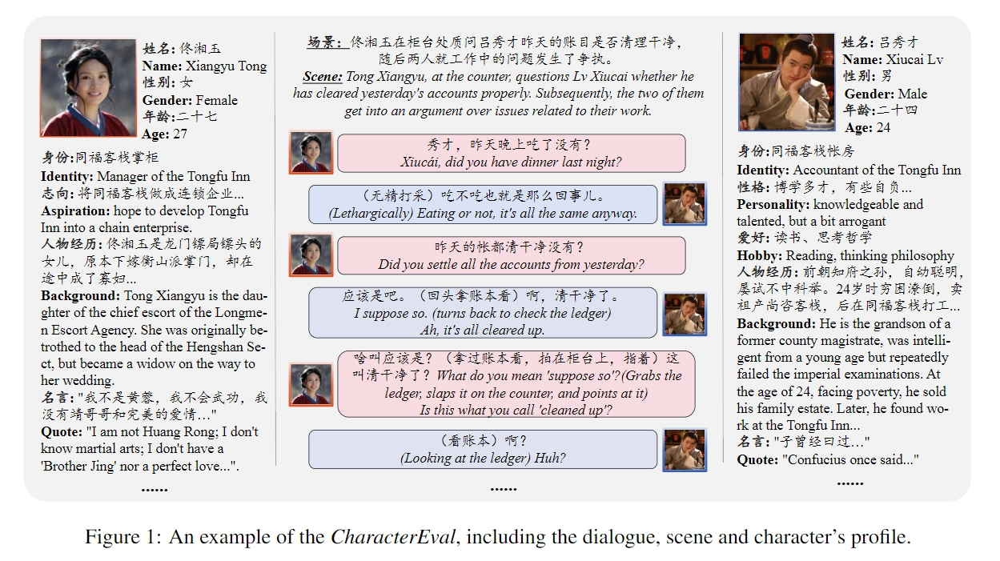
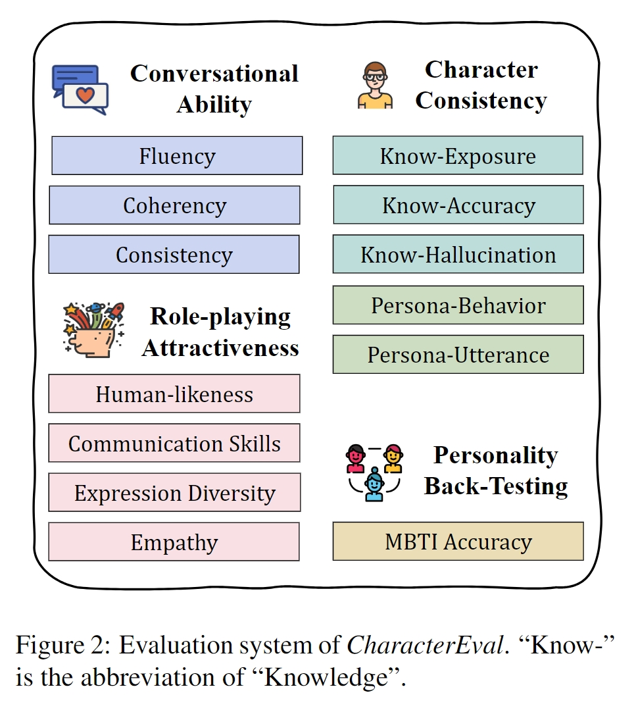
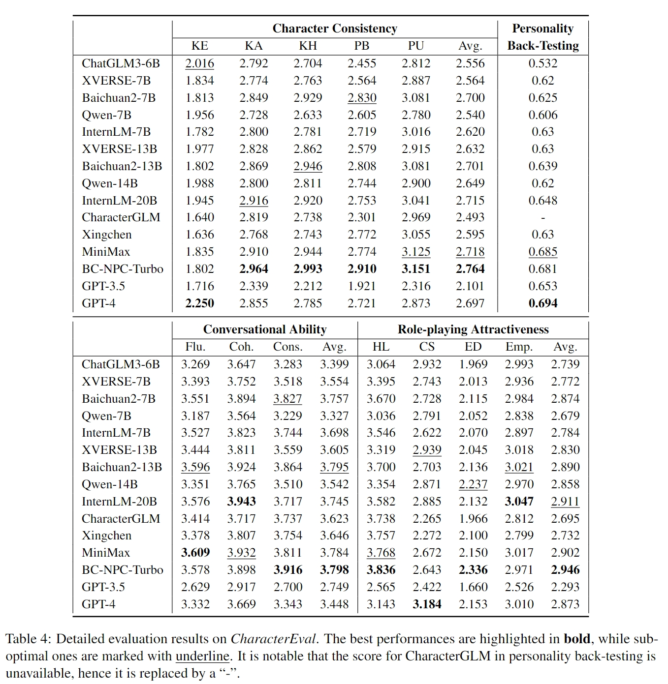

# *CharacterEval*: A Chinese Benchmark for Role-Playing Conversational Agent Evaluation

<div align="center">

</div>


*CharacterEval* is a Chinese benchmark designed for evaluating Role-Playing Conversational Agents (**RPCAs**). It consists of 1,785 multi-turn role-playing dialogues and 23,020 examples featuring 77 characters derived from Chinese novels and scripts. Additionally, it provides in-depth character profiles sourced from Baidu Baike. Furthermore, *CharacterEval* employs a multifaceted evaluation approach, encompassing thirteen targeted metrics across four dimensions. To facilitate evaluation, we have also developed a character-based reward model (CharacterRM) based on manual annotations. Experimental results demonstrate that the pearson correlation coefficient of CharacterRM with human significantly surpasses that of GPT-4. Please refer to our paper for more details (https://arxiv.org/abs/2401.01275). 

## News
[2024-5-31] We publish the document for manual annotation (Predefined Annotated Examples of CharacterEval.pdf), which primarily includes descriptions of each dimension and two examples (one with the highest score and one with the lowest score). We recruited a total of 12 annotators, divided into two groups, to score all the cases. For cases with disagreement, discussions are held to reach a consistent score. Additionally, these examples will be used as demonstrations for in-context learning with GPT-4.

## Evaluation Dimensions
<div align="center">

</div>

## Leaderboard
<div align="center">

</div>


## Installation
```bash 
pip install -r requirements.txt
```

## Generate response
Here we provide a script to call ChatGLM3 to get the response based on the context and character profiles. You could adjust it to adapt the input format of your model.
```bash
CUDA_VISIBLE_DEVICES=0 python get_response.py
# data/test_data.jsonl + data/character_profiles.json -> results/generation.jsonl
```

## Transform format
As mentioned in our paper, we introduce annotators to sparsely evaluate the performance matrix. This approach entails that each example in CharacterEval is assessed using a subset of all subjective metrics, leading to more differentiated evaluation results. So we need transform the format of genereted result for reward model evaluation.
```bash
python transform_format.py
# results/generation.jsonl + data/id2metric.json -> results/generation_trans.jsonl
```

## Run CharacterRM
Now, we should download the [BaichuanCharRM](https://huggingface.co/morecry/BaichuanCharRM) and use it to evaluate the generated responses. 
```bash
CUDA_VISIBLE_DEVICES=0 python run_char_rm.py 
# results/generation_trans.jsonl + data/character_profiles.json -> results/evaluation
```

## Compute evaluation scores
The last step is just to compute the average evaluation score on each metric.
```bash
python compute_score.py
```

For reproduction of our results, we provide the intermediate running results of five open-source models (under ```results/```), including ChatGLM-6B, Baichuan-7B-Chat, XVERSE-7B-Chat, InternLM-7B-Chat and Qwen-7B-Chat. All of the model checkpoints are downloaded from [Hugginface](https://huggingface.co/).
